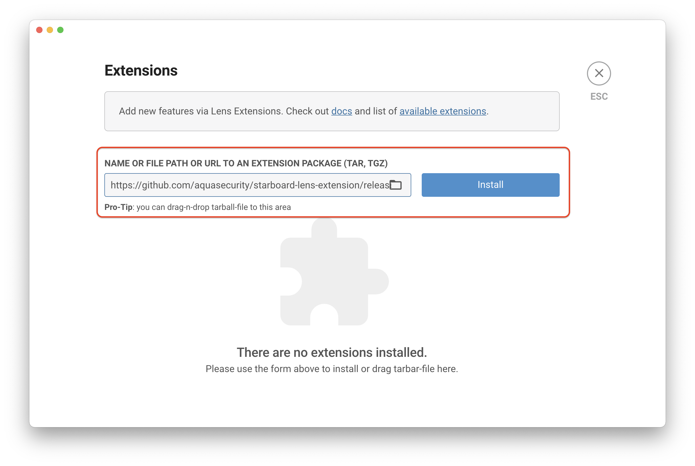
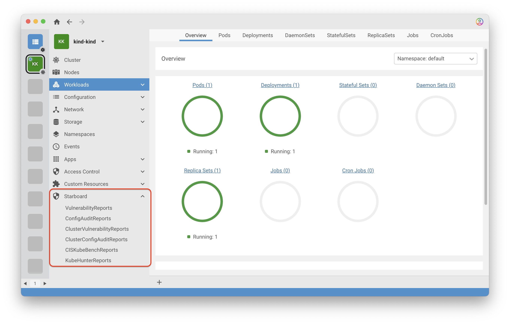

# Starboard Lens Extension

> This is a [Lens][lens] extension for [Starboard][starboard] which provides visibility into
> vulnerability assessment reports for Kubernetes workloads stored as [custom security resources][starboard-crds].

[![GitHub Release][release-img]][release]
[![GitHub Build Actions][build-action-img]][actions]
[![License][license-img]][license]

[](https://youtu.be/X-bhVwmp2l4)

## Installation

This guide shows how to install the extension either from source or from pre-built binary releases.

### Prerequisites

* Lens >= [4.0.0-rc1.4][min-lens] should first be [installed][lens-installation].
* Follow Starboard [Getting Started][starboard-getting-started] guide to understand how Starboard is
  initialized and how it generates security reports, which are then stored as custom resources.

### From the Binary Releases

Every [release][release] of Lens extension for Starboard provides the tarball-file that can be manually
downloaded and installed. Alternatively, you can copy the download URL of the release artifact to paste it in the
**Manage Lens Extensions** page.

1. Download your desired version from GitHub [release][release] page or GitHub
   [package registry](https://github.com/aquasecurity/starboard-lens-extension/packages/520430). Alternatively,
   just copy the download URL of the release artifact.
2. Open Lens application and select **Lens** menu, and then click **Extensions** item, or press
   <kbd>Shift</kbd> + <kbd>Command</kbd> + <kbd>E</kbd> to open the **Manage Lens Extensions** page.
3. Specify the path (.tar, .tgz) or download URL to the extension package and click **Install**.
   
4. If everything is fine, you'll see the `@aquasecurity/starboard-lens-extension` extension listed under
   **Installed Extensions**. Click **Enable** to enable it.
   
5. Close the **Manage Lens Extensions** page and verify that the **Starboard** menu item shows up in the main menu.
   

### From Source (Linux, macOS)

Building from source is slightly more work, but is the best way to go if you want to test the latest (pre-release)
version of the extension.

You must have a working Node.js environment.

1. Clone the source code to the `~/.k8slens/extensions/starboard-lens-extensions` directory and build the extension's package:
   ```
   $ mkdir -p ~/.k8slens/extensions
   $ git clone https://github.com/aquasecurity/starboard-lens-extension.git ~/.k8slens/extensions/starboard-lens-extension
   $ cd ~/.k8slens/extensions/starboard-lens-extensions
   $ npm install && npm run build
   ```
2. Open Lens application and select **Lens** menu, and then click **Extensions** item, or press
   <kbd>Shift</kbd> + <kbd>Command</kbd> + <kbd>E</kbd> to open the **Manage Lens Extensions** page.
3. If everything is fine, you'll see the `@aquasecurity/starboard-lens-extension` extension listed under
   **Installed Extensions**. Click **Enable** to enable it.
   

## Getting Started

> **NOTE**: As the source code of the extension is evolving very fast, some screenshots shown below
> may be outdated. We'll also update this section with more examples.

- VulnerabilityReports

  
- ConfigAuditReports

  
- CISKubeBenchReports

[lens]: https://github.com/lensapp/lens
[starboard]: https://github.com/aquasecurity/starboard
[starboard-crds]: https://github.com/aquasecurity/starboard#custom-security-resources-definitions
[starboard-getting-started]: https://github.com/aquasecurity/starboard#getting-started

[lens-installation]: https://github.com/lensapp/lens#installation
[lens-releases]: https://github.com/lensapp/lens/releases
[release-img]: https://img.shields.io/github/release/aquasecurity/starboard-lens-extension.svg?logo=github
[release]: https://github.com/aquasecurity/starboard-lens-extension/releases
[build-action-img]: https://github.com/aquasecurity/starboard-lens-extension/workflows/Build/badge.svg
[actions]: https://github.com/aquasecurity/starboard-lens-extension/actions
[license]: https://github.com/aquasecurity/starboard-lens-extension/blob/master/LICENSE
[license-img]: https://img.shields.io/github/license/aquasecurity/starboard-lens-extension

[min-lens]: https://github.com/lensapp/lens/releases/tag/v4.0.0-rc.1
